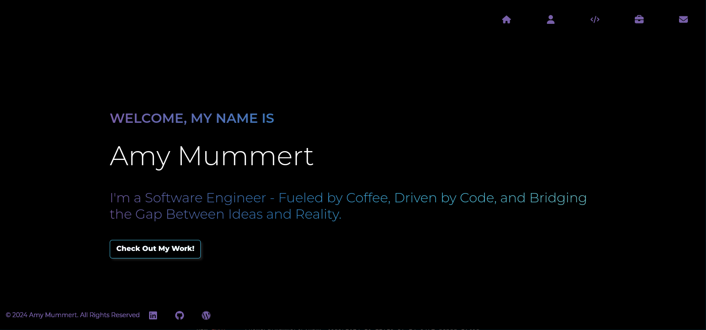
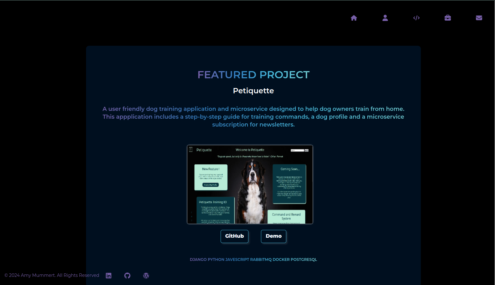
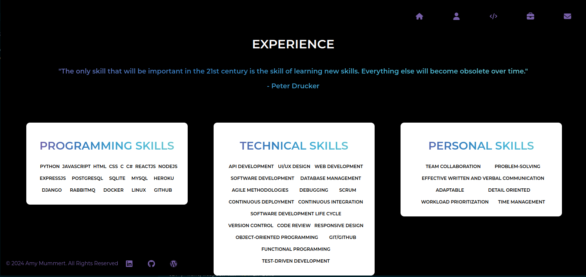

# Web Developer Portfolio

Welcome to the web developer portfolio! This project showcases a developers work, skills, and experiences as a Developer. Built with **React**, it provides an interactive and responsive platform to explore a developer's projects, learn about the developer's background, and get in touch.

## Table of Contents

- [About the Project](#about-the-project)
- [Features](#features)
- [Built With](#built-with)
- [Getting Started](#getting-started)
  - [Prerequisites](#prerequisites)
  - [Installation](#installation)
- [Tools and Technologies](#tools-and-technologies)
- [Citations](#citations)

## About the Project
Created with Django Backend for the APIs & React Frontend for the user interface.

This project is a web developers portfolio application that showcases your work 
to prospective employers or clients.  

## Features

- **Responsive design**: Works on both desktop and mobile devices.
- **Project gallery**: Displays projects with links to live demos and GitHub repositories.

  
- **Experience section**: Overview of professional background, skills, and technologies.

  
- **Contact form**: Allows visitors to send me messages directly.
- **Blog (optional)**: A section for writing about web development, tools, and experiences.

## Built With

- [React](https://reactjs.org/)
- [JavaScript](https://developer.mozilla.org/en-US/docs/Web/JavaScript)
- [HTML](https://developer.mozilla.org/en-US/docs/Web/HTML)
- [CSS](https://developer.mozilla.org/en-US/docs/Web/CSS)
- [React Router](https://reactrouter.com/)
- [Node.js](https://nodejs.org/) (for backend API if applicable)
- [PostgreSQL](https://www.postgresql.org/) (or other databases if applicable)

## Getting Started

To get a local copy up and running, follow these steps.

### PREREQUISITES
Make sure you have the following installed:

- Node.js (>=14.x)
- npm (>=6.x) or yarn (>=1.x)
- React (>=18.0.0)
- Django (>=5.1.3)

## Tools and Technologies
1. IDEs / Editors / Debuggers 
    - Visual Studio Code for Django backend for building backend services and utilizing the database
    - Visual Studio Code for React frontend for building frontend and the user interface
    - Visual Studio Code for Debugging
2. Languages
    - HTML for Django and React to build the UI
    - CSS for the design of the portfolio
    - Javascript to build the UI in React
    - Python for Django backend services
3. Package Managers
    - npm for React dependencies
    - pip for Python dependencies
4. Version Control
    - Git
    - Github for project repository
5. Test Framework
    - PyTest - TestCase for Django backend testing
    - React Testing Library for React testing
6. Software Libraries
    - Django REST framework for building APIs
    - React for frontend views and components
    - Django for backend framework
    - Fetch API for making HTTP requests from React
    - React-router-dom for frontend components
7. Database
    - Django built-in database for organizing and managing project data
8. UI Interface
    - Figma for UI design of each web page
9. Hosting Service
    - Dreamhost for hosting my portfolio application (https://www.mummertar.xyz) 
    - Heroku for backend and frontend deployment

# INSTALLATION
## Clone or download this project repository

Django Backend
1. cd ./portfolio_backend
2. Create your virtual environment - `python -m venv env`
3. Activate your virtual environment in bash - `env\Scripts\activate` (Windows) `source env/bin/activate` (MacOS)
4. `pip install django`
5. `pip install django-rest-framework`
6. `pip install -r requirements.txt` or `pip freeze > requirements.txt`
7. `pip install django-cors-headers`
8. `pip manage.py makemigrations`
9. `python manage.py migrate`
10. `python manage.py createsuperuser` - Django Admin: http://127.0.0.1:8000/admin 
11. `python -m pip install -r portfolio_backend/requirements.txt` - to set up your own virtual environment
12. `python manage.py runserver` 

React Frontend
1. cd ./portfolio_frontend
2. `npm install react`
3. `npm install react-route-dom`
4. `npm install axios`
5. `npm start` - React Front End: https://localhost:3000

# CITATIONS

- https://v5.reactrouter.com/web/guides/quick-start
- https://www.stackhawk.com/blog/django-cors-guide/
- https://ordinarycoders.com/blog/article/build-a-django-contact-form-with-email-backend
- https://www.django-rest-framework.org/tutorial/2-requests-and-responses/
- https://react-hook-form.com/docs/useform/handlesubmit
- https://www.digitalocean.com/community/tutorials/build-a-to-do-application-using-django-and-react
- https://medium.com/@gazzaazhari/django-backend-react-frontend-basic-tutorial-6249af7964e4
- https://react.dev/learn
- https://docs.djangoproject.com/en/5.0/
- https://github.com/django/django

## CSS / Icons / Animations / Buttons
- https://www.iconfinder.com/icons/326717/more_unfold_icon  - Author: Google / Icon Finder
- https://developer.mozilla.org/en-US/docs/Web/CSS/CSS_animations/Using_CSS_animations
- https://getcssscan.com/css-buttons-examples

## UI/UX
- UI/UX designed with Figma

